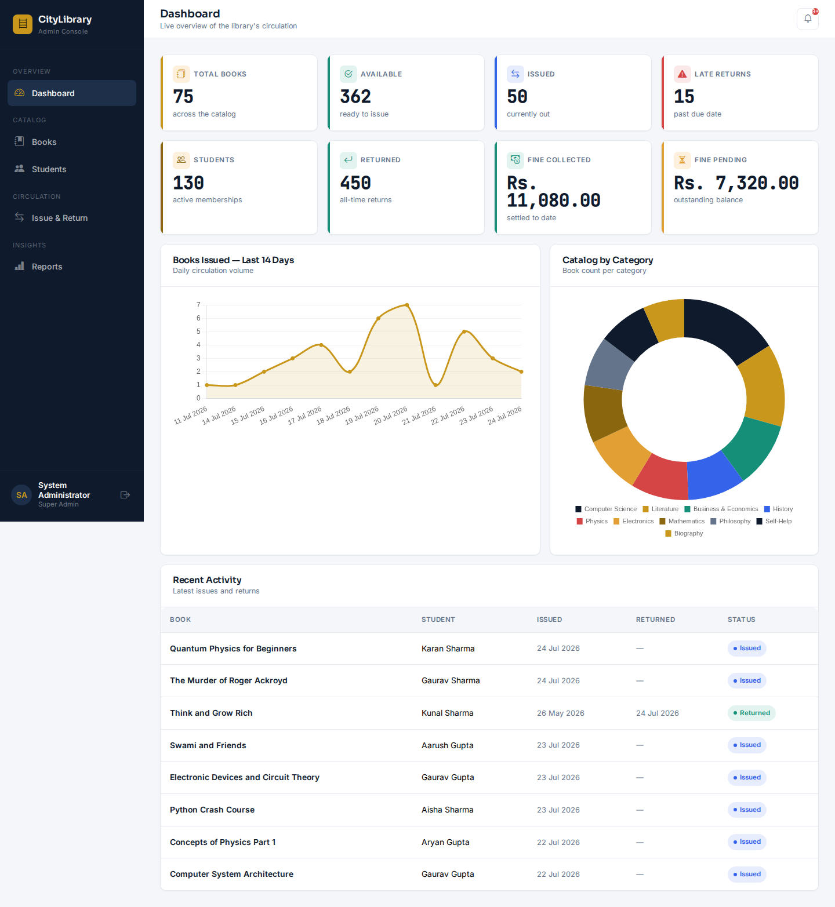
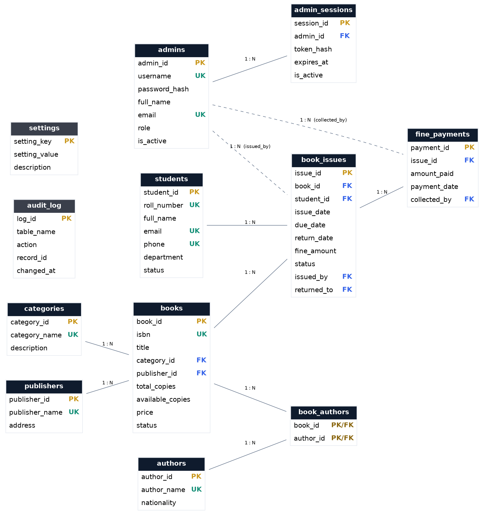

# CityLibrary — Advanced Library Management System

A production-style Library Management System built to demonstrate strong
**SQL / database engineering** alongside a real full-stack implementation —
FastAPI (Python) on the backend, MySQL as the primary and only data store,
and a Bootstrap 5 admin dashboard on the front end.

This isn't a toy CRUD demo: circulation rules (max books per student, fine
calculation, stock counts) are enforced **inside the database** via stored
procedures, triggers and functions, wrapped in real transactions — not just
in application code. The goal was to build something that would hold up in
a SQL Developer / Database Developer / Backend Developer interview.



---

## Tech Stack

| Layer     | Technology                                              |
|-----------|----------------------------------------------------------|
| Database  | **MySQL 8 / MariaDB 10.6+** — schema, views, functions, procedures, triggers |
| Backend   | **Python 3.11+, FastAPI**, PyMySQL (raw parameterized SQL, no ORM), JWT auth |
| Frontend  | HTML5, CSS3, vanilla JavaScript, **Bootstrap 5**, Chart.js |

The frontend deliberately uses no build step (no npm/webpack needed to run
it) — open the HTML files, or serve them with any static file server.
Bootstrap, Bootstrap Icons, Chart.js and the project's fonts are **vendored
locally** under `frontend/vendor/`, so the whole app runs fully offline —
no CDN dependency, no flaky network during a demo.

---

## Why this project is SQL-first

Every item on a typical "SQL Developer" checklist is implemented and
**exercised by the running application**, not left as an unused script:

| Requirement | Where |
|---|---|
| 3NF normalized schema, PK/FK/UNIQUE/CHECK constraints | `database/01_schema.sql` |
| Indexes (including a composite + a FULLTEXT index) | `database/01_schema.sql` |
| Views | `database/03_views.sql` (9 views) |
| Stored procedures with transactions (`START TRANSACTION`/`COMMIT`/`ROLLBACK`, exit handlers) | `database/04_procedures.sql` |
| Functions | `database/02_functions.sql` |
| Triggers (validation via `SIGNAL`, stock auto-maintenance, audit logging) | `database/05_triggers.sql` |
| Dynamic SQL / prepared statements (`PREPARE` / `EXECUTE`) | `sp_search_books` in `04_procedures.sql` |
| INNER / LEFT JOIN, GROUP BY, HAVING, subqueries, aggregate functions | throughout `03_views.sql` |
| Pagination, searching, sorting | `sp_search_books`, and parameterized `LIMIT/OFFSET` queries in `backend/app/routers/*.py` |
| Query optimization via indexing | `idx_issues_due_status` composite index supports the overdue report directly |
| Prepared statements from the app layer | every query in `backend/app/routers/*.py` uses `%s` placeholders (PyMySQL), never string interpolation |
| Backup / restore scripts | `scripts/backup_db.sh`, `scripts/restore_db.sh` |

See **[docs/SQL_HIGHLIGHTS.md](docs/SQL_HIGHLIGHTS.md)** for a guided tour with
explanations of *why* each piece is designed the way it is — the kind of
thing worth walking an interviewer through.

---

## Features

**Authentication** — bcrypt password hashing, JWT bearer tokens, and a
DB-backed `admin_sessions` table so sessions can be revoked/audited
server-side instead of being purely stateless.

**Dashboard** — total/available/issued/returned books, active students,
late returns, fine collected vs. pending, a 14-day issue trend chart, a
catalog-by-category donut chart, and a recent-activity feed.

**Book Management** — add/edit/delete, search by title/ISBN/author,
filter by category, sort by title/price/year/availability, pagination.
Multi-author books are supported via a `book_authors` junction table.

**Student Management** — add/update/delete, search, per-student rollup of
books currently held, overdue count, and fine balance.

**Book Issue Module** — issue/return with automatic due-date and late-fine
calculation, partial fine payments, full issue history.

**Reports** — available books, currently borrowed, overdue (with days late
and estimated fine), most borrowed (ranked), per-student borrow history,
and a fine collection report.

Every delete is constraint-aware: a book or student with loan history
can't be silently hard-deleted (the FK is `ON DELETE RESTRICT` by design)
— the app catches that and marks the record discontinued/inactive instead,
so historical reports never go stale or orphaned.

---

## Project Structure

```
library-management-system/
├── database/
│   ├── 00_create_database_and_user.sql   # run first, as root
│   ├── 01_schema.sql                     # tables, keys, constraints, indexes
│   ├── 02_functions.sql
│   ├── 03_views.sql
│   ├── 04_procedures.sql
│   ├── 05_triggers.sql
│   └── 06_seed_data.sql                  # realistic sample dataset
├── backend/
│   ├── app/
│   │   ├── main.py                       # FastAPI app + router registration
│   │   ├── config.py                     # env-based settings
│   │   ├── database.py                   # connection pool + query helpers
│   │   ├── security.py                   # bcrypt + JWT
│   │   ├── dependencies.py               # auth dependency
│   │   ├── routers/                      # auth, dashboard, books, students, issues, reports, lookups
│   │   └── schemas/                      # Pydantic request/response models
│   ├── requirements.txt
│   └── .env.example
├── frontend/
│   ├── index.html                        # login
│   ├── dashboard.html / books.html / students.html / issues.html / reports.html
│   ├── css/style.css
│   ├── js/                               # api.js (shared client), one file per page
│   └── vendor/                           # Bootstrap, Chart.js, self-hosted fonts (no CDN)
├── scripts/
│   ├── setup_database.sh                 # one-shot DB bootstrap
│   ├── backup_db.sh
│   └── restore_db.sh
├── docs/
│   ├── er-diagram.svg / .png
│   ├── SQL_HIGHLIGHTS.md
│   └── screenshots/
├── backups/                              # created by backup_db.sh
├── INSTALLATION.md
└── README.md
```

---

## Quick Start

See **[INSTALLATION.md](INSTALLATION.md)** for full setup instructions. In short:

```bash
# 1. Database
mysql -u root -p < database/00_create_database_and_user.sql
mysql -u library_admin -p library_management_system < database/01_schema.sql
mysql -u library_admin -p library_management_system < database/02_functions.sql
mysql -u library_admin -p library_management_system < database/03_views.sql
mysql -u library_admin -p library_management_system < database/04_procedures.sql
mysql -u library_admin -p library_management_system < database/05_triggers.sql
mysql -u library_admin -p library_management_system < database/06_seed_data.sql
# (or just: bash scripts/setup_database.sh)

# 2. Backend
cd backend
python3 -m venv venv && source venv/bin/activate   # Windows: venv\Scripts\activate
pip install -r requirements.txt
cp .env.example .env      # then edit DB credentials / JWT secret
uvicorn app.main:app --reload --port 8000

# 3. Frontend — any static server works, e.g.:
cd ../frontend
python3 -m http.server 5500
# open http://localhost:5500
```

**Demo login:** username `admin`, password `Admin@123`

---

## Entity-Relationship Diagram



`students` and `books` connect through `book_issues` (the circulation
ledger); `books` and `authors` connect through `book_authors` (a proper
many-to-many junction table, since a book can have multiple authors and
an author can have multiple books). `admin_sessions`, `fine_payments` and
`audit_log` round out the schema for auth, payments and traceability.

---

## Design Notes

- **No ORM, on purpose.** Every query is written by hand with parameterized
  SQL (PyMySQL) — the point of this project is to demonstrate SQL fluency,
  not hide it behind an abstraction layer.
- **Business rules live in the database.** `sp_issue_book` won't issue a
  book past the 3-per-student cap or to a blocked student even if called
  directly from the MySQL CLI — the rule doesn't depend on the API being
  the only caller.
- **Stock counts are trigger-maintained**, not computed by the app, so
  `available_copies` can never drift out of sync with actual issue rows.
- **Constraint-aware deletes.** FKs are `ON DELETE RESTRICT` deliberately;
  the API catches the resulting `IntegrityError` and downgrades to a soft
  delete rather than losing history.

---

## License

MIT — see [LICENSE](LICENSE).
